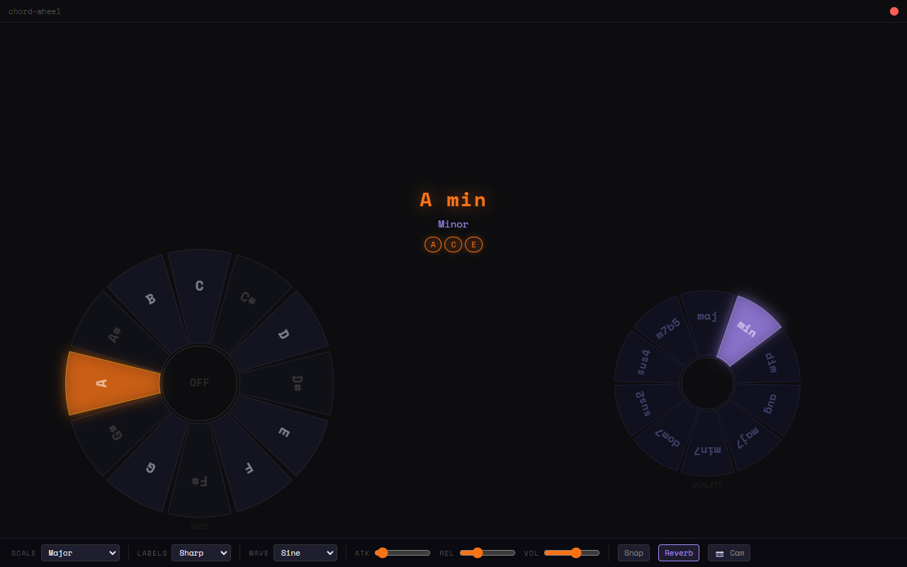
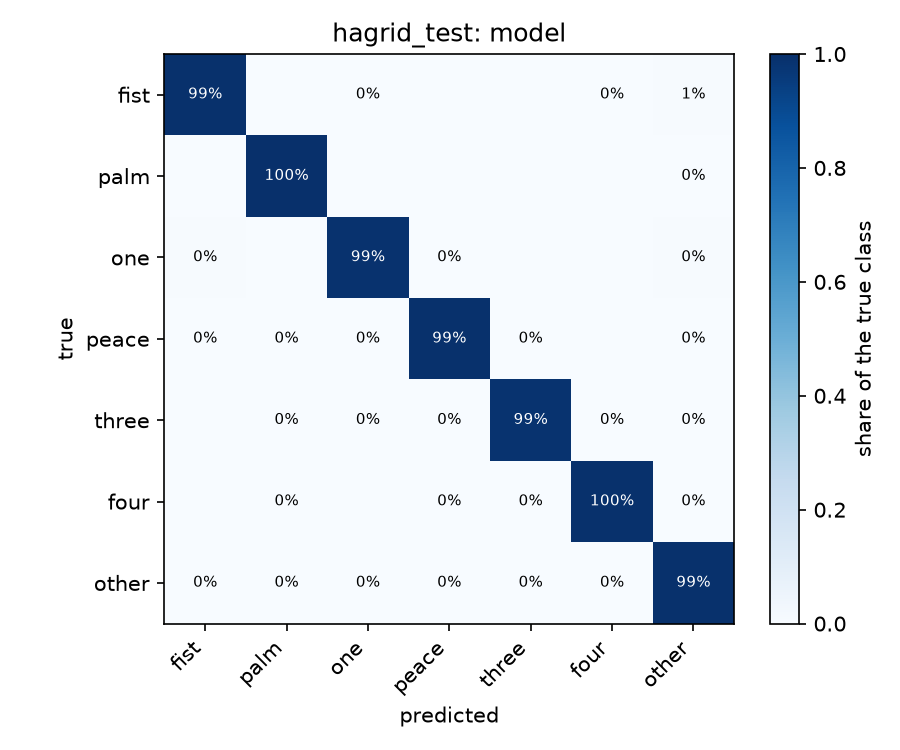
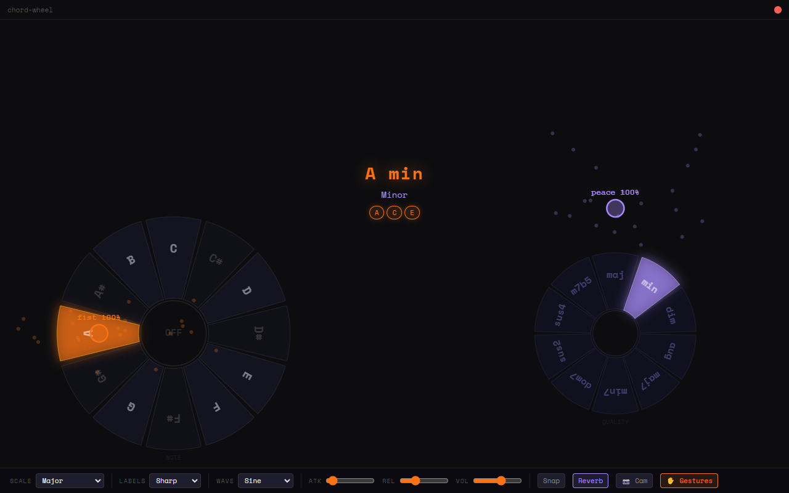

# Chord Wheel

[](https://github.com/nguyenhanhatminh0105-hue/Chord-Wheel/actions/workflows/tests.yml)

An Electron desktop app that lets you explore and play chords interactively. Click the wheel to trigger notes, or enable the webcam and use hand gestures via MediaPipe to play hands-free.



## Features

- **Interactive chord wheel** — click any slice to play a chord
- **Hand tracking** — optional webcam mode using MediaPipe; point to play
- **Gesture control** — a small neural network (PyTorch, run in the app with ONNX Runtime) reads each hand's pose: a fist plays, an open palm releases, finger counts pick the chord quality
- **9 scales** — Major, Minor, Pentatonic, Blues, Dorian, Phrygian, Lydian, Mixolydian, Harmonic Minor
- **10 chord qualities** — maj, min, dim, aug, maj7, min7, dom7, sus2, sus4, m7b5
- **Built-in synthesizer** — sine, triangle, sawtooth, or square wave with attack/release envelope
- **Reverb** and **volume** controls
- **Note labeling** — Sharp, Flat, or Solfège
- **Snap mode** — lock to scale tones only

## Gesture control

With the camera on, **✋ Gestures** lets the shape of each hand, not just its position, control the app. A network of 14,215 weights reads the 21 landmarks MediaPipe finds on a hand and names its pose. The left hand's pose decides whether to play or only move; the right hand's pose picks the chord quality, so chords change without travelling to the quality wheel.

**Left hand: play or move**

| Pose | Over a note slice | Elsewhere |
|---|---|---|
| fist | plays that note (sliding to another slice plays the new one) | releases |
| palm | moves silently; releases a held chord | releases |
| other | keeps the previous state | keeps the previous state |

**Right hand: chord quality by shape**

| Pose | Quality |
|---|---|
| one (index finger) | maj |
| peace | min |
| three (index, middle, ring) | dom7 |
| four | maj7 |
| palm | min7 |
| fist | sus4 |
| other | unchanged; hovering over the quality wheel still works |

**Results.** Scored on people the model never saw in training, against hand-written finger-counting rules:

| Test set | Hands | Model accuracy | Model macro-F1 | Rules accuracy | Rules macro-F1 |
|---|---|---|---|---|---|
| HaGRID test (people never seen in training) | 59,578 | 0.993 | 0.991 | 0.782 | 0.828 |





More: [model card](ml/MODEL_CARD.md) · [how it works](docs/how-it-works.md) · [design](docs/gesture-control-design.md) · [reproduce the training](ml/README.md)

## Getting Started

```bash
npm install
npm start
```

Requires Node.js and a webcam (optional, for hand tracking).

On Windows, `launch.vbs` (which calls `launch.bat`) offers a double-click, no-terminal way to start the app once the repo path inside `launch.bat` is updated to match your local checkout.

## Tests

The music theory (note names, scales, chord spelling and pitch) lives in `theory.js`, apart from the audio and drawing code in `renderer.js`, so it runs under plain Node:

```bash
npm test
```

The gesture model's Python code has its own tests (set-up in [ml/README.md](ml/README.md)), and an end-to-end check starts the real app and feeds it recorded hand poses:

```bash
ml/.venv/Scripts/python -m pytest ml/tests -q
npm run e2e
```
