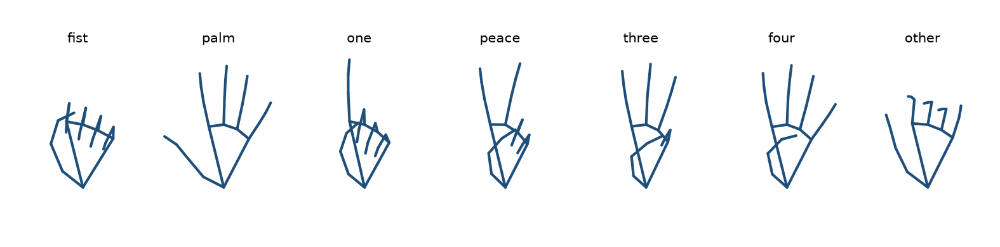

# How gesture control works

A walk through the pipeline, from a camera frame to a chord: what each stage does, why, and how it is checked. The design and its trade-offs are in [gesture-control-design.md](gesture-control-design.md); the numbers are in the [model card](../ml/MODEL_CARD.md).

```
camera frame -> MediaPipe Hands -> 21 landmarks per hand -> feature transform (42 numbers)
             -> network (ONNX Runtime) -> 7 probabilities -> smoothing -> play / release / chord quality
```

## The feature transform

MediaPipe gives each of a hand's 21 landmarks as `(x, y)`, where `x` is divided by the image width and `y` by the image height. The network should see the hand's shape and nothing else: not where it is in the frame, how big it is, or how it is tilted. Five steps, identical in Python ([`ml/gesturenet/features.py`](../ml/gesturenet/features.py)) and JavaScript ([`gestures/features.js`](../gestures/features.js)), get there:

1. **Pixel-proportional coordinates.** Multiply every `x` by the image width and every `y` by the image height, so one unit is the same distance in both directions. Without this, the same hand looks wider on a 16:9 frame than on a 4:3 one.
2. **Translate.** Subtract the wrist (landmark 0) from every point, so the wrist is the origin.
3. **Rotate upright.** Let `v` be the middle finger's knuckle (landmark 9) and `s = |v|`. Map every point `(x, y)` to `((-v.y·x + v.x·y) / s, (-v.x·x - v.y·y) / s)`, which turns `v` to point straight up (negative `y`, as in image coordinates).
4. **Scale.** Divide every point by `s`, so the knuckle lands on `(0, -1)` whatever the hand's size or distance.
5. **Flatten** to `[x0, y0, x1, y1, …, x20, y20]`: 42 numbers.

If `s` is below 1e-6 (a degenerate detection) the frame is skipped.

**Worked example.** The second case in [`ml/tests/fixtures/features.json`](../ml/tests/fixtures/features.json) is a 640 × 480 frame (its landmarks are random points, which exercise the arithmetic as well as a real hand):

| | normalised | pixels (step 1) | after translating (step 2) |
|---|---|---|---|
| wrist, landmark 0 | (0.7650, 0.6347) | (489.60, 304.66) | (0, 0) |
| landmark 1 | (0.5592, 0.3040) | (357.89, 145.90) | (-131.71, -158.77) |
| knuckle, landmark 9 | (0.1523, 0.6963) | (97.48, 334.23) | `v` = (-392.12, 29.57) |

So `s = |v| = 393.23`. Rotating landmark 1 gives `(168.22, -119.40)`, and dividing by `s` gives `(0.4278, -0.3036)`. The first four features are therefore `0, 0, 0.4278, -0.3036`, and landmark 9 becomes `(0, -1)`, as it does for every hand. The fixture's expected features come from the Python transform ([`ml/scripts/make_fixtures.py`](../ml/scripts/make_fixtures.py)), and a JavaScript test checks that the JavaScript transform reproduces all 51 cases to within 1e-9.

**Training data needs step 1 too.** HaGRID stores the same divided coordinates but not the image sizes. Nearly all of its hands are upright, so the hands cannot reveal the aspect; instead, the calibration samples 2,400 image sizes from HaGRID's 512-pixel release, which keeps each image's proportions. 73.8 % are portrait 3:4, so HaGRID's `x` values are multiplied by 0.75.

**The result, per class.** Averaging the transformed training hands of each class (mirrored so left and right hands line up) shows the shape the network learns:



`three` is index, middle and ring; `other` is a blur because it mixes several gestures with relaxed hands. Note the folded thumb in `peace`, `three` and `four`, crossing the palm toward the little finger; it matters for the rules baseline below.

## The network

A multilayer perceptron: 42 inputs → 128 → 64 → 7 outputs, ReLU after each hidden layer, dropout 0.2 after each hidden layer during training, softmax at the end ([`ml/gesturenet/model.py`](../ml/gesturenet/model.py)).

The weights: 42 × 128 + 128 = 5,504; 128 × 64 + 64 = 8,256; 64 × 7 + 7 = 455; 14,215 in all. The input is a short fixed-length vector with no image grid and no sequence, so there is nothing for convolution or recurrence to exploit; time is handled by smoothing (below). A model this small runs in a few hundredths of a millisecond on a laptop CPU.

## Training

[`ml/gesturenet/train.py`](../ml/gesturenet/train.py): 276,965 hands from 25,525 people.

- **Class weights.** Half the hands (137,746) are `other`, about six times as many as any one pose, so the cross-entropy is weighted by inverse class frequency: 0.29 for `other`, about 1.7 for each pose. Without it, the network would gain more by getting `other` right than by getting the poses right.
- **Augmentation**, applied to the pixel-proportional landmarks before the feature transform, a fresh draw every epoch:
  - *Horizontal flip* (probability 0.5): HaGRID does not say which hand is which, and the app sees both, so the network learns both mirror images.
  - *Stretch* by ±25 %, horizontal and vertical independently: covers the aspect calibration being approximate (one HaGRID image in four is not 3:4) and differences between people's hands.
  - *Rotation* by ±15°: on its own it would be undone by step 3, which turns every hand upright; applied before the stretch, it varies the direction of the stretch relative to the hand.
  - *Scale* by ±10 %: undone by step 4. Harmless, and kept because the design lists it.
  - *Noise* of 1 % of `s` on every landmark: MediaPipe's landmarks jitter from frame to frame.
- **Optimiser:** AdamW, learning rate 1e-3, weight decay 1e-4, batch 512.
- **Early stopping on validation macro-F1** (the mean of the per-class F1 scores): at most 60 epochs, stopping after 8 without improvement and keeping the best epoch. Macro-F1 rather than accuracy, because accuracy would let the many `other` hands hide a weak pose. It peaked at 0.990 in epoch 15; training stopped at epoch 23.

## Why the split is by person

The training split averages 11 hands per person, some people contribute hundreds, and one person's photos are alike: the same hand, skin, camera and room. Split the hands at random and most test hands have siblings from the same person in the training set, so the test score partly measures recognising people already seen, and it overstates how well the model will do for a new user. HaGRID's official split puts each person in exactly one of train (25,525 people), validation (2,040) and test (2,380); the calibration script checks it on the downloaded data. The test score therefore measures people the model has never seen, which is the situation of anyone who installs the app.

## From PyTorch to the app

- **Export.** [`ml/gesturenet/export.py`](../ml/gesturenet/export.py) wraps the network with its softmax and exports it with PyTorch's `torch.export`-based ONNX exporter (opset 18) to [`models/gestures.onnx`](../models/gestures.onnx), 66 KB, with input `landmarks` `[N, 42]` and output `probs` `[N, 7]`. The batch size `N` is dynamic, so one call classifies both hands.
- **Parity checks.** Every change is checked at both seams: the JavaScript feature transform against the Python one (the fixture above), and ONNX Runtime's output against PyTorch's on 1,000 test hands (largest difference 2.4e-7).
- **In the app.** [`gestures/classifier.js`](../gestures/classifier.js) runs the model with `onnxruntime-node` inside the Electron renderer. Only one inference is in flight: a frame that arrives while one is running is skipped, not queued, so a slow frame never builds a backlog. A two-hand frame takes about 0.02 ms on the development laptop; a unit test fails if it averages over 2 ms. [`gestures/controller.js`](../gestures/controller.js) ignores a result that arrives after its hand has left the frame.

## Smoothing and actions

Each hand has its own smoother ([`gestures/smoother.js`](../gestures/smoother.js)) over its last 5 frames. A pose takes effect when it is the top class in at least 3 of them and its mean probability over those frames is at least 0.7. `other` never takes effect, and a pose stays until another pose wins. For example:

| Frame | Top class (probability) | Last 5 frames | Pose in effect |
|---|---|---|---|
| 1 | fist (0.95) | fist | none yet |
| 2 | fist (0.90) | fist ×2 | none yet |
| 3 | fist (0.85) | fist ×3, mean 0.90 | **fist** |
| 4 | other (0.60) | fist ×3, other | fist |
| 5 | palm (0.80) | fist ×3, other, palm | fist |
| 6 | palm (0.90) | fist ×2, other, palm ×2 | fist |
| 7 | palm (0.95) | fist, other, palm ×3, mean 0.88 | **palm** |

A one-frame misreading never acts, and a real change takes three frames: about 50-100 ms at 30-60 frames per second.

The smoothed poses then act through [`gestures/actions.js`](../gestures/actions.js), as in the tables in the [README](../README.md#gesture-control): the left hand's `fist` plays the note under the palm and its `palm` releases it; the right hand's shape picks the chord quality.

## Results

The [README](../README.md#gesture-control) has the results table, and [`ml/reports/`](../ml/reports/) has the confusion matrices for the model and for the rules. On HaGRID's test split the model reaches 0.993 accuracy and 0.991 macro-F1, against 0.782 and 0.828 for finger-counting rules.

The rules baseline counts raised fingers and maps the set to a pose. The design first defined a raised thumb as one whose tip is farther from the index knuckle than its middle joint is. On HaGRID's test hands that called a folded thumb raised in 65-91 % of fists, peace signs, threes and fours, because a folded thumb crosses the palm away from the index knuckle (see the mean poses above). Measuring from the little finger's knuckle instead fixed it, raising the rules from 0.386 to 0.828 macro-F1. Of five candidate rules, that one was chosen on the training split and scored once on the test split, so the comparison with the model is fair.

What the rules still get wrong is the hand that means nothing: three in four relaxed, non-gesturing hands count five raised fingers and become `palm`. The network has learned what a relaxed hand looks like, and its recall on `other` is 0.993.
